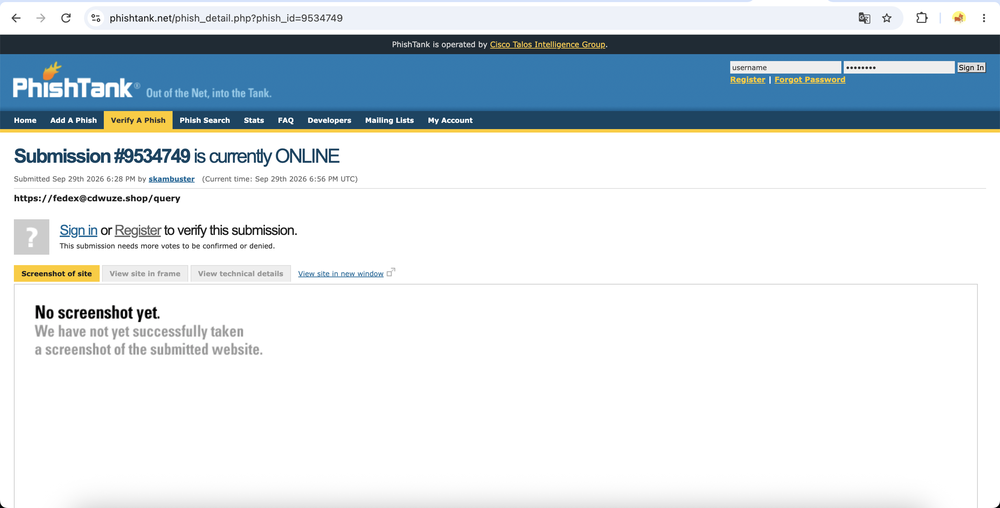
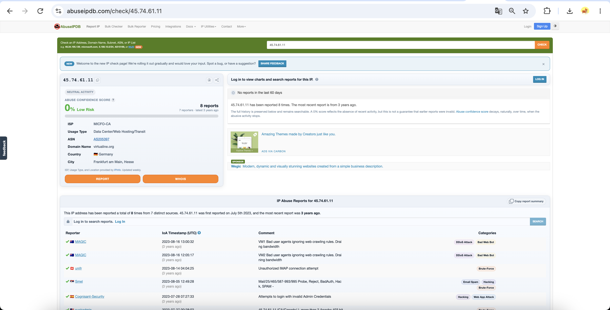
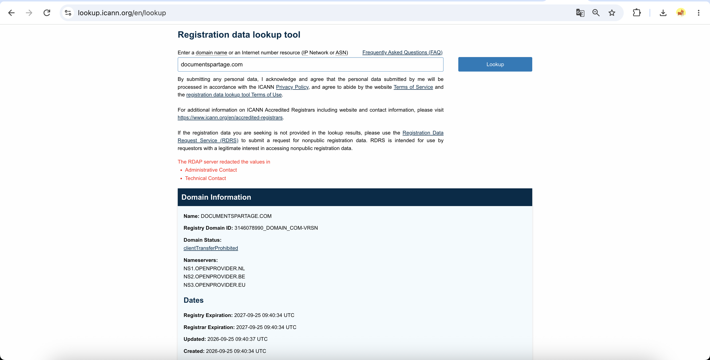
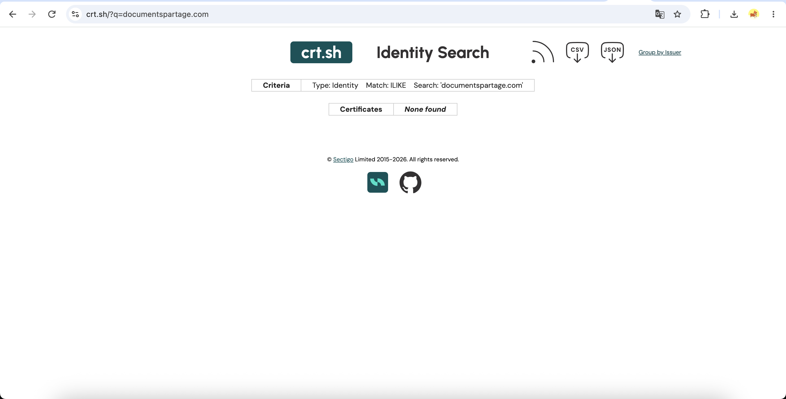

# Week 2 — Data Collection Process

**Applied to:** Cyber Threat Intelligence Analysis of Phishing Infrastructure

**Recap of Week 1:**  
Week 1 established the theoretical CTI foundation for the project by defining key CTI terms, classifying phishing-related threats, identifying relevant indicators of compromise, and selecting public threat-intelligence sources.

---

## Research Questions

**RQ1:** Which open-source threat intelligence sources provide the most useful information for phishing infrastructure analysis?

**RQ2:** Can different OSINT platforms provide different or conflicting results for the same phishing indicator?

**RQ3:** Does combining URL, domain, IP, registration, certificate, and reputation data provide stronger evidence than relying on a single source?

---

## 1. Open-Source vs. Closed-Source Data

Threat intelligence can be collected from both open and closed sources.

| Data Type | Examples Used / Considered | Why It Matters |
|---|---|---|
| Open-source (OSINT) | VirusTotal, URLhaus, PhishTank, AbuseIPDB, ICANN Lookup, crt.sh, AlienVault OTX | Publicly accessible, reproducible, and suitable for this academic project |
| Closed-source / Commercial | Enterprise SIEM logs, EDR telemetry, private SOC data, paid threat-intelligence feeds | Can provide deeper internal context, but are unavailable for this project |

**Decision:**  
This project is based mainly on open-source and freemium threat-intelligence platforms because they can be accessed without enterprise infrastructure and allow the methodology to be reproduced.

---

## 2. Data Source Selection

The following sources were selected for phishing infrastructure analysis.

| Source | Data Provided | Role in the Project |
|---|---|---|
| URLhaus | Malicious URLs and related infrastructure | Source of malicious or suspicious URLs |
| PhishTank | Reported phishing URLs | Source of phishing samples |
| VirusTotal | URL, domain, IP, and file reputation | Reputation and multi-vendor validation |
| AbuseIPDB | IP reputation and abuse reports | Investigation of suspicious IP addresses |
| ICANN Lookup | Domain registration data | Registrar and registration information |
| crt.sh | Certificate Transparency records | Identification of certificates and related domains |
| AlienVault OTX | Threat intelligence indicators and pulses | Search for related indicators and campaign context |

---

## 3. Sample Selection Strategy

A real phishing or malicious indicator should be selected from a public threat-intelligence source such as URLhaus or PhishTank.

The malicious page itself should not be opened directly.

Instead, the indicator should be investigated through safe lookup interfaces.

### Selected Sample

**Source:** [INSERT SOURCE: URLhaus / PhishTank]

**URL:**  
`[INSERT URL]`

**Domain:**  
`[INSERT DOMAIN]`

**Date observed:**  
`[INSERT DATE]`

**Source status:**  
`[INSERT SOURCE VERDICT]`

### Evidence

---

## 4. VirusTotal Investigation

The selected URL or domain was checked using VirusTotal to determine whether security vendors had already identified it as malicious.

**Indicator checked:**  
`[INSERT DOMAIN OR URL]`

**Detection result:**  
`[INSERT RESULT, e.g. 5/91 vendors flagged the domain]`

**Additional information:**

- Registrar: `[INSERT]`
- Domain creation date: `[INSERT]`
- Categories/tags: `[INSERT]`
- Related IP address: `[INSERT]`

### Screenshot

### Interpretation

VirusTotal showed that `[INSERT INTERPRETATION]`.

This result demonstrates that reputation platforms can provide useful context, but their verdict should not be treated as the only source of truth.

---

## 5. IP Reputation Investigation

The related IP address was checked using AbuseIPDB.

**IP address:**  
`[INSERT IP]`

**Abuse Confidence Score:**  
`[INSERT SCORE]`

**Total reports:**  
`[INSERT NUMBER]`

**ISP / Hosting provider:**  
`[INSERT PROVIDER]`

**Country:**  
`[INSERT COUNTRY]`

### Screenshot

### Interpretation

The AbuseIPDB result showed that `[INSERT INTERPRETATION]`.

This provides infrastructure-level context that is not available from URL-only analysis.

---

## 6. Domain Registration Investigation

The domain was checked using ICANN Lookup or WHOIS.

**Domain:**  
`[INSERT DOMAIN]`

**Registrar:**  
`[INSERT REGISTRAR]`

**Creation date:**  
`[INSERT DATE]`

**Expiration date:**  
`[INSERT DATE]`

**Domain age:**  
`[INSERT AGE]`

### Screenshot

### Interpretation

The registration information suggests that `[INSERT INTERPRETATION]`.

A recently registered domain can be suspicious, but domain age alone is not sufficient to classify an indicator as malicious.

---

## 7. Certificate Transparency Investigation

Certificate Transparency data was checked using crt.sh.

**Domain:**  
`[INSERT DOMAIN]`

**Certificates found:**  
`[INSERT NUMBER]`

**Related subdomains:**  
`[INSERT RELATED SUBDOMAINS]`

**Issuer:**  
`[INSERT ISSUER]`

### Screenshot

### Interpretation

Certificate Transparency data can help identify additional infrastructure associated with the same domain.

In this case, `[INSERT FINDING]`.

---

## 8. AlienVault OTX Investigation

The indicator was searched in AlienVault OTX to identify related indicators or threat-intelligence pulses.

**Indicator:**  
`[INSERT DOMAIN/IP/URL]`

**Pulses found:**  
`[INSERT NUMBER]`

**Related indicators:**  
`[INSERT RESULTS]`

### Screenshot

### Interpretation

AlienVault OTX provided `[INSERT CONTEXT]`.

This type of threat-intelligence platform can reveal relationships between individual indicators and larger campaigns.

---

## 9. Cross-Source Comparison

The same indicator was compared across multiple sources.

| Source | Indicator | Result |
|---|---|---|
| URLhaus / PhishTank | `[INSERT]` | `[INSERT RESULT]` |
| VirusTotal | `[INSERT]` | `[INSERT RESULT]` |
| AbuseIPDB | `[INSERT IP]` | `[INSERT RESULT]` |
| ICANN Lookup | `[INSERT DOMAIN]` | `[INSERT RESULT]` |
| crt.sh | `[INSERT DOMAIN]` | `[INSERT RESULT]` |
| AlienVault OTX | `[INSERT]` | `[INSERT RESULT]` |

### Key Observation

The most important finding from the comparison was:

`[WRITE YOUR MAIN FINDING HERE]`

Example:

Different intelligence sources provided different levels of context. One source identified the URL as malicious, while another source had limited or no detections. Infrastructure-level sources such as WHOIS and AbuseIPDB provided additional context that was not visible from URL reputation alone.

---

## 10. Data Source Mapping

| Investigation Task | Primary Source | Secondary Source |
|---|---|---|
| Identify phishing URLs | URLhaus / PhishTank | AlienVault OTX |
| Check URL/domain reputation | VirusTotal | AlienVault OTX |
| Analyze IP reputation | AbuseIPDB | VirusTotal |
| Check registration data | ICANN Lookup | WHOIS |
| Identify certificates | crt.sh | — |
| Find related indicators | AlienVault OTX | VirusTotal |

This mapping defines which source should be used for each stage of phishing infrastructure analysis.

---

## 11. Research Findings

### RQ1 — Which sources provide the most useful information?

The most useful sources were `[INSERT SOURCES]` because they provided `[INSERT REASON]`.

No single platform provided all the required information.

---

### RQ2 — Can different OSINT sources disagree?

Yes.

For the selected sample, `[INSERT EXAMPLE OF DIFFERENCE]`.

This demonstrates that threat-intelligence analysis should not rely on a single reputation platform.

---

### RQ3 — Does combining multiple indicators improve analysis?

Yes.

Combining URL, domain, IP, registration, certificate, and reputation data provided more context than analyzing only one indicator.

The combined analysis showed `[INSERT CONCLUSION]`.

---

## 12. Limitations

The Week 2 investigation has several limitations:

- public intelligence sources can contain outdated information;
- reputation results may change over time;
- some services have API or request limits;
- not every malicious domain appears in every threat feed;
- WHOIS information may be privacy-protected;
- shared hosting can make IP-based conclusions unreliable;
- this investigation uses a limited number of real samples;
- the results represent the state of the sources at the time of analysis.

---

## 13. Connection to the Final Project

Week 2 establishes the data-collection layer of the phishing infrastructure analysis workflow.

The results show that phishing infrastructure should be analyzed using multiple sources rather than a single reputation service.

The collected indicators from this week will be used in Week 3 for:

- filtering;
- normalization;
- deduplication;
- enrichment;
- correlation;
- preparation for structured CTI analysis.

---

## References

1. URLhaus  
   https://urlhaus.abuse.ch/

2. PhishTank  
   https://phishtank.org/

3. VirusTotal  
   https://www.virustotal.com/

4. AbuseIPDB  
   https://www.abuseipdb.com/

5. ICANN Registration Data Lookup  
   https://lookup.icann.org/

6. Certificate Transparency Search — crt.sh  
   https://crt.sh/

7. AlienVault Open Threat Exchange  
   https://otx.alienvault.com/

8. OSINT Framework  
   https://osintframework.com/

9. SANS Institute — Cyber Security Whitepapers  
   https://www.sans.org/white-papers/

10. MISP Project  
    https://www.misp-project.org/

---

## Week 2 Deliverables Checklist

- [x] Open-source and closed-source intelligence sources identified
- [x] Relevant OSINT platforms selected
- [ ] Real phishing sample collected from a public source
- [ ] VirusTotal investigation completed
- [ ] IP reputation investigation completed
- [ ] WHOIS / ICANN investigation completed
- [ ] Certificate Transparency investigation completed
- [ ] AlienVault OTX investigation completed
- [ ] Cross-source comparison completed
- [x] Data source mapping prepared
- [ ] Research questions answered using real evidence
- [x] Limitations documented
