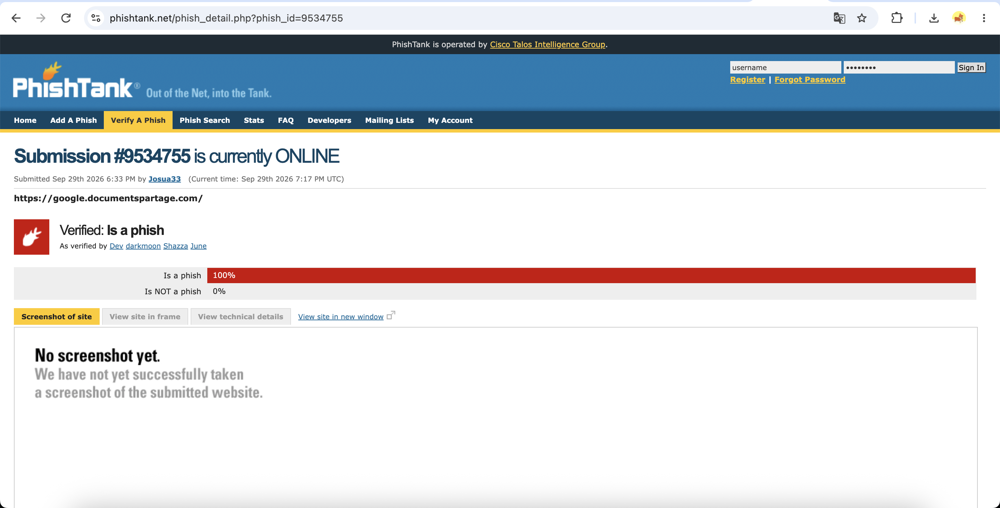
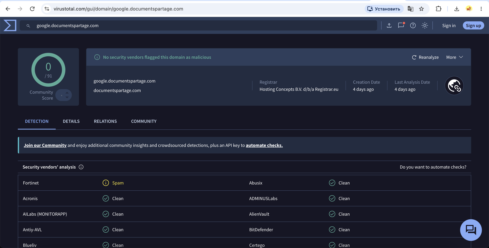
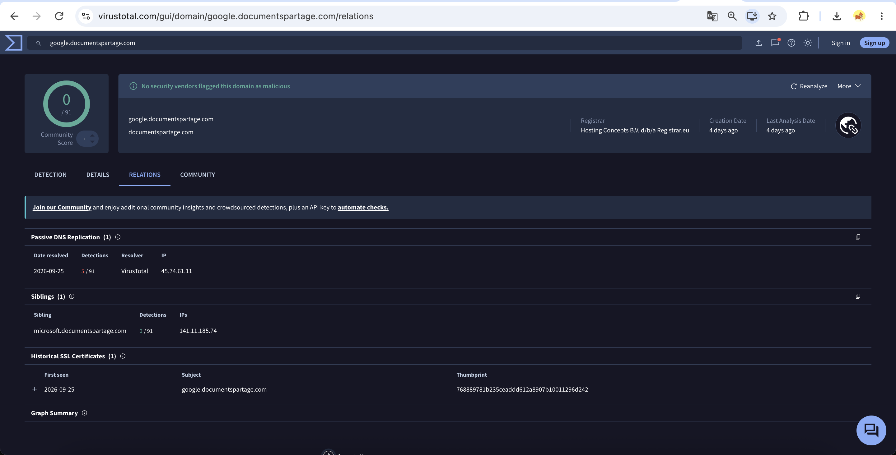

# Week 2 — Data Collection Process

**Applied to:** Cyber Threat Intelligence Analysis of Phishing Infrastructure

**Recap of Week 1:**  
Week 1 established the theoretical CTI foundation for the project by defining key CTI terms, classifying phishing-related threats, identifying relevant indicators of compromise, and selecting public threat-intelligence sources.

---

## Research Questions

**RQ1:** Which open-source threat intelligence sources provide the most useful information for phishing infrastructure analysis?

**RQ2:** Can different OSINT platforms provide different or conflicting results for the same phishing indicator?

**RQ3:** Does combining URL, domain, IP, registration, certificate, and reputation data provide stronger evidence than relying on a single source?

---

## 1. Open-Source vs. Closed-Source Data

Threat intelligence can be collected from both open and closed sources.

| Data Type | Examples Used / Considered | Why It Matters |
|---|---|---|
| Open-source (OSINT) | VirusTotal, URLhaus, PhishTank, AbuseIPDB, ICANN Lookup, crt.sh, AlienVault OTX | Publicly accessible, reproducible, and suitable for this academic project |
| Closed-source / Commercial | Enterprise SIEM logs, EDR telemetry, private SOC data, paid threat-intelligence feeds | Can provide deeper internal context, but are unavailable for this project |

**Decision:**  
This project is based mainly on open-source and freemium threat-intelligence platforms because they can be accessed without enterprise infrastructure and allow the methodology to be reproduced.

---

## 2. Data Source Selection

The following sources were selected for phishing infrastructure analysis.

| Source | Data Provided | Role in the Project |
|---|---|---|
| URLhaus | Malicious URLs and related infrastructure | Source of malicious or suspicious URLs |
| PhishTank | Reported phishing URLs | Source of phishing samples |
| VirusTotal | URL, domain, IP, and file reputation | Reputation and multi-vendor validation |
| AbuseIPDB | IP reputation and abuse reports | Investigation of suspicious IP addresses |
| ICANN Lookup | Domain registration data | Registrar and registration information |
| crt.sh | Certificate Transparency records | Identification of certificates and related domains |
| AlienVault OTX | Threat intelligence indicators and pulses | Search for related indicators and campaign context |

---

## 3. Sample Selection

A verified and currently online phishing URL was selected from PhishTank for further investigation.

**Source:** PhishTank  
**Phish ID:** 9534755  
**URL:** `https://google.documentspartage.com/`  
**Registered domain:** `documentspartage.com`  
**Subdomain:** `google`  
**Submitted:** September 29, 2026, 6:33 PM  
**Verification status:** Verified — Is a phish  
**Online status:** Online  

The sample was selected because it uses `google` as a subdomain, which may make the URL appear related to Google at first glance. However, the actual registered domain is `documentspartage.com`.

### Evidence



---

## 4. VirusTotal Investigation

The selected phishing subdomain was checked using VirusTotal.

**Indicator checked:** `google.documentspartage.com`

**Detection result:** 0/91 security vendors flagged the domain as malicious.

**Additional information:**

- Registrar: Hosting Concepts B.V. d/b/a Registrar.eu
- Creation date: 4 days before the analysis
- Last analysis date: 4 days before the analysis
- Fortinet classification: Spam

### Evidence



### Interpretation

VirusTotal did not classify the domain as malicious at the time of analysis, even though PhishTank had already verified the URL as a valid phishing site.

This demonstrates an important limitation of relying on a single threat-intelligence source. A phishing site hosted under a recently registered parent domain may not yet be detected by most reputation engines.

The very recent domain creation date also provides additional suspicious context, although domain age alone is not sufficient to classify a site as malicious.

---

## 5. Infrastructure Relations

VirusTotal passive DNS data showed that the phishing subdomain `google.documentspartage.com` resolved to the following IP address:

**Resolved IP:** `45.74.61.11`  
**Date resolved:** September 25, 2026  
**VirusTotal detections for the IP:** 5/91

VirusTotal also identified a sibling subdomain:

**Sibling:** `microsoft.documentspartage.com`  
**Resolved IP:** `141.11.185.74`  
**Detections:** 0/91

This is an important infrastructure finding because the same parent domain contains multiple brand-themed subdomains, including `google` and `microsoft`. This may indicate that the infrastructure is being reused for impersonation or phishing-related activity.

VirusTotal also recorded a historical SSL certificate associated with `google.documentspartage.com`.

### Evidence



---
## 6. IP Reputation Investigation

The IP address associated with `google.documentspartage.com` was checked using AbuseIPDB.

**IP address:** `45.74.61.11`

**Abuse Confidence Score:** 0% — Low Risk  
**Total reports:** 8  
**Distinct reporters:** 7  
**Most recent report:** approximately 3 years ago  
**ISP:** MICFO-CA  
**Usage type:** Data Center/Web Hosting/Transit  
**ASN:** AS205397  
**Domain name:** virtualine.org  
**Country:** Germany  
**City:** Frankfurt am Main, Hesse

Historical reports included categories such as DDoS attacks, bad web bots, brute-force activity, email spam, hacking, and web application attacks.

### Evidence


### Interpretation

AbuseIPDB currently assigns the IP address an Abuse Confidence Score of 0%, indicating low current risk according to its scoring model.

However, the IP has been reported eight times historically, and the previous reports include several types of malicious or suspicious activity.

This result differs from VirusTotal, where the same IP had 5/91 detections. It also differs from PhishTank, which had already verified the associated URL as phishing.

The comparison demonstrates that reputation scores depend heavily on the source, update time, and type of data being analyzed. A low current AbuseIPDB score does not necessarily mean that the infrastructure is safe.

---

## 7. Domain Registration Investigation

The registered domain `documentspartage.com` was checked using the ICANN Registration Data Lookup Tool.

**Domain:** `documentspartage.com`  
**Registrar:** Hosting Concepts B.V. d/b/a Registrar.eu  
**Created:** September 25, 2026  
**Updated:** September 25, 2026  
**Expiration:** September 25, 2027  

**Nameservers:**

- NS1.OPENPROVIDER.NL
- NS2.OPENPROVIDER.BE
- NS3.OPENPROVIDER.EU

The registrant information was redacted by the RDAP service.

### Evidence


### Interpretation

The domain was created only a few days before the phishing sample was submitted to PhishTank.

This recent registration date provides additional suspicious context when combined with the verified phishing status from PhishTank.

However, domain age alone is not sufficient to classify a domain as malicious. In this investigation, it is used together with reputation, passive DNS, and other OSINT evidence.

---

## 8. Certificate Transparency Investigation

The registered domain `documentspartage.com` was checked using crt.sh to identify publicly logged TLS certificates and related subdomains.

**Domain checked:** `documentspartage.com`

**Result:** No certificates were found in crt.sh at the time of analysis.

### Evidence


### Interpretation

No Certificate Transparency records were returned for `documentspartage.com`.

This may indicate that certificate information for the domain had not yet appeared in the crt.sh dataset at the time of analysis, or that no matching certificate record was available through this source.

This result is especially relevant because VirusTotal had already shown a historical SSL certificate associated with `google.documentspartage.com`, demonstrating that different OSINT sources may have different levels of visibility and update timing.

---

## 9. Data Source Mapping

| Investigation Task | Primary Source | Secondary Source | Data Collected |
|---|---|---|---|
| Identify verified phishing URL | PhishTank | URLhaus | URL, status, submission date |
| Check domain reputation | VirusTotal | PhishTank | Vendor detections, classification |
| Identify related infrastructure | VirusTotal Relations | — | IP addresses, sibling domains, passive DNS |
| Check IP reputation | AbuseIPDB | VirusTotal | Abuse score, reports, ASN, hosting information |
| Check domain registration | ICANN Lookup | — | Creation date, registrar, nameservers |
| Check certificate data | crt.sh | VirusTotal | Certificate Transparency records |

This mapping defines which sources are used at each stage of the phishing infrastructure investigation.

---

## 10. Cross-Source Comparison

The same phishing infrastructure was analyzed across several independent OSINT and threat-intelligence sources.

| Source | Indicator | Result | Interpretation |
|---|---|---|---|
| PhishTank | `https://google.documentspartage.com/` | Verified as a valid phish and online | Confirms the URL was identified by the PhishTank community as phishing |
| VirusTotal | `google.documentspartage.com` | 0/91 vendors flagged the domain as malicious; Fortinet classified it as Spam | The phishing subdomain was not widely detected by reputation engines at the time of analysis |
| VirusTotal Passive DNS | `45.74.61.11` | 5/91 detections; resolved on 2026-09-25 | Shows infrastructure-level risk that was not visible from the domain verdict alone |
| VirusTotal Relations | `microsoft.documentspartage.com` | Sibling subdomain identified, 0/91 detections | Suggests reuse of the same parent domain for multiple brand-themed subdomains |
| AbuseIPDB | `45.74.61.11` | Abuse Confidence Score: 0%; 8 historical reports from 7 reporters | Indicates low current reputation risk but confirms historical abuse activity |
| ICANN Lookup | `documentspartage.com` | Created on 2026-09-25; registrar: Hosting Concepts B.V. d/b/a Registrar.eu | Very recent registration provides additional suspicious context |
| crt.sh | `documentspartage.com` | No certificates found | Certificate Transparency visibility was limited for the registered domain at the time of analysis |

### Key Observation

The most important finding is that the different sources did not provide the same verdict.

PhishTank had already verified the URL as phishing, while VirusTotal showed no malicious detections for the phishing subdomain itself.

At the same time, VirusTotal passive DNS showed that the associated IP address had 5/91 detections, while AbuseIPDB assigned the same IP a current Abuse Confidence Score of 0%.

ICANN data also showed that the registered domain had been created only a few days before the phishing submission.

This demonstrates that phishing infrastructure cannot be evaluated reliably using only one reputation source.

---

## 11. Research Findings

### RQ1 — Which open-source threat intelligence sources provide the most useful information for phishing infrastructure analysis?

The most useful sources were PhishTank, VirusTotal, AbuseIPDB, and ICANN Lookup because each source provided a different type of information.

- PhishTank provided the strongest direct phishing verdict.
- VirusTotal provided multi-vendor reputation data, passive DNS, and infrastructure relations.
- AbuseIPDB provided historical IP abuse context.
- ICANN Lookup provided domain registration information.

No single source provided enough information to fully understand the infrastructure.

---

### RQ2 — Can different OSINT platforms provide different or conflicting results for the same phishing indicator?

Yes.

The selected URL was verified as phishing by PhishTank, but the subdomain `google.documentspartage.com` received 0/91 malicious detections in VirusTotal.
The associated IP address `45.74.61.11` had 5/91 detections in VirusTotal, while AbuseIPDB currently rated it at 0% abuse confidence.
These differences show that reputation systems use different datasets, detection methods, and update cycles.

---

### RQ3 — Does combining multiple independent indicators provide stronger evidence than relying on a single indicator?

Yes.

The strongest conclusion came from combining several independent observations:

- PhishTank confirmed the URL as phishing.
- The parent domain was only a few days old.
- The subdomain used the brand-like label `google`.
- VirusTotal identified the IP address `45.74.61.11`.
- The same parent domain also contained the sibling `microsoft.documentspartage.com`.
- The IP had historical abuse reports.
- Different threat-intelligence services returned different risk assessments.

Together, these indicators provide significantly more context than any single reputation score.

---

## 12. Main Finding

The Week 2 investigation showed that a phishing site can remain undetected by many automated reputation engines even after it has already been identified by another threat-intelligence community.

The investigated infrastructure demonstrates the importance of cross-source correlation.

A single `0/91` VirusTotal result could create a false sense of safety, but additional evidence from PhishTank, ICANN, passive DNS, and historical IP reputation provided a much stronger basis for analysis.

This finding directly supports the project methodology: phishing infrastructure should be evaluated using multiple independent CTI and OSINT sources rather than a single verdict.

---

## 13. Limitations

The investigation has several limitations:

- Only one verified phishing sample was analyzed in detail.
- VirusTotal results represent the state of vendor detections at the time of analysis and may change later.
- AbuseIPDB confidence scores decay over time and may not reflect newly observed phishing use.
- crt.sh returned no certificate records for the registered domain, limiting independent certificate analysis.
- AlienVault OTX was unavailable during the investigation.
- Shared hosting can make IP-based conclusions unreliable because one IP address may host unrelated domains.
- Domain age is only contextual evidence and cannot independently prove malicious activity.
- OSINT data can be incomplete, delayed, or inconsistent between sources.

---

## 14. Connection to the Final Project

Week 2 established the data collection and validation methodology for the project.

The collected evidence shows that phishing infrastructure analysis should use several intelligence layers:

```text
Phishing Feed
     ↓
URL / Domain
     ↓
Reputation Analysis
     ↓
Passive DNS
     ↓
IP Reputation
     ↓
Domain Registration
     ↓
Certificate Data
     ↓
Cross-Source Correlation
```

---

## References

1. URLhaus  
   https://urlhaus.abuse.ch/

2. PhishTank  
   https://phishtank.org/

3. VirusTotal  
   https://www.virustotal.com/

4. AbuseIPDB  
   https://www.abuseipdb.com/

5. ICANN Registration Data Lookup  
   https://lookup.icann.org/

6. Certificate Transparency Search — crt.sh  
   https://crt.sh/

7. OSINT Framework  
   https://osintframework.com/

8. SANS Institute — Cyber Security Whitepapers  
   https://www.sans.org/white-papers/

9. MISP Project  
    https://www.misp-project.org/

---

## Week 2 Deliverables Checklist

- [x] Open-source and closed-source intelligence sources identified
- [x] Relevant OSINT platforms selected
- [x] Real phishing sample collected from a public source
- [x] VirusTotal investigation completed
- [x] IP reputation investigation completed
- [x] WHOIS / ICANN investigation completed
- [x] Certificate Transparency investigation completed
- [x] AlienVault OTX lookup attempted
- [x] Cross-source comparison completed
- [x] Data source mapping prepared
- [x] Research questions answered using real evidence
- [x] Limitations documented
