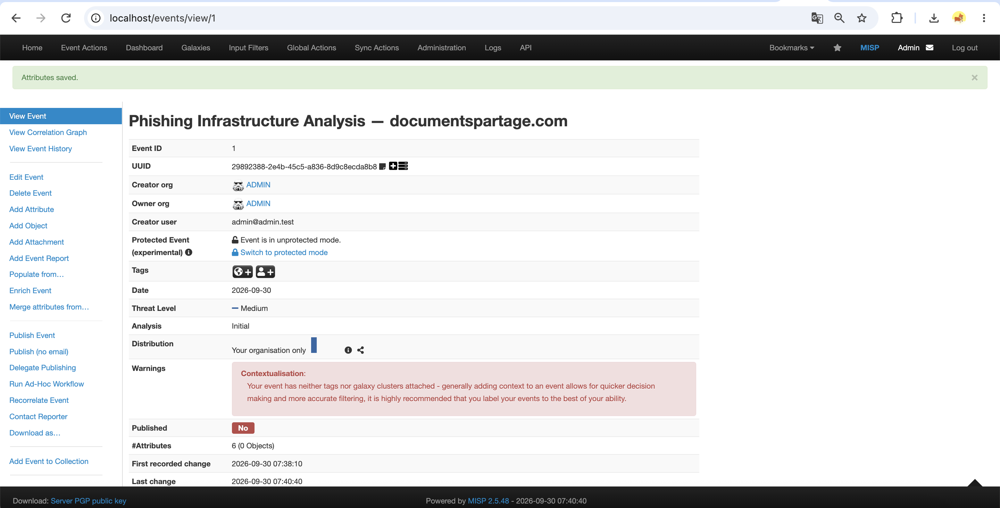
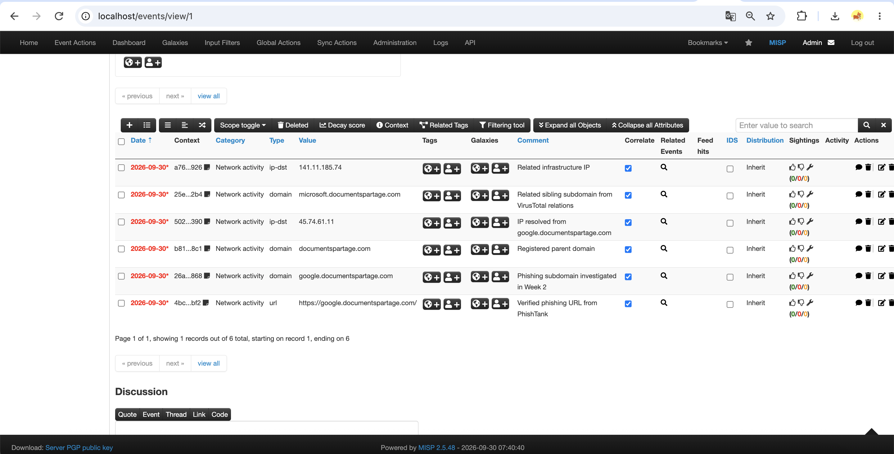
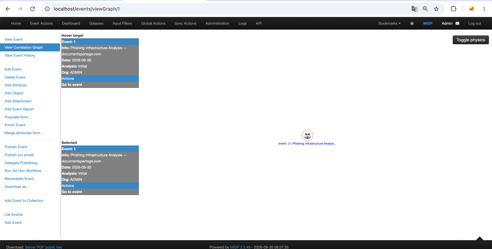

# Week 3 — Data Processing and Exploitation

**Applied to:** Cyber Threat Intelligence Analysis of Phishing Infrastructure

## Recap of Week 2

Week 2 established the data-collection and validation methodology for the project.

A verified phishing sample was selected from PhishTank and investigated across several independent OSINT and threat-intelligence sources, including VirusTotal, AbuseIPDB, ICANN Lookup, and crt.sh.

The investigation identified the following infrastructure:

- verified phishing URL: `https://google.documentspartage.com/`
- phishing subdomain: `google.documentspartage.com`
- registered parent domain: `documentspartage.com`
- related IP address: `45.74.61.11`
- related sibling subdomain: `microsoft.documentspartage.com`
- related IP address: `141.11.185.74`

Week 3 focuses on transforming these raw observations into structured threat intelligence through filtering, normalization, enrichment, correlation, and MISP.

---

## 1. Raw IOC Dataset

The raw IOC dataset was created from indicators collected during Week 2.

| Value | Type | Source | Context |
|---|---|---|---|
| `https://google.documentspartage.com/` | URL | PhishTank | Verified phishing URL |
| `google.documentspartage.com` | Domain | VirusTotal | Phishing subdomain |
| `documentspartage.com` | Domain | ICANN Lookup | Registered parent domain |
| `45.74.61.11` | IP | VirusTotal | Resolved infrastructure IP |
| `45.74.61.11` | IP | AbuseIPDB | Historical abuse context |
| `microsoft.documentspartage.com` | Domain | VirusTotal Relations | Related sibling subdomain |
| `141.11.185.74` | IP | VirusTotal Relations | Related infrastructure IP |

The raw dataset contains indicators from different sources and therefore includes duplicated values and different levels of contextual information.

---

## 2. IOC Schema

To make the indicators easier to process and import into MISP, a common schema was defined.

| Field | Description |
|---|---|
| `value` | IOC value |
| `type` | URL, domain, or IP |
| `source` | Source where the indicator was observed |
| `confidence` | Analyst-assigned confidence level |
| `status` | Malicious, suspicious, contextual, or unknown |
| `tags` | Additional classification |
| `notes` | Supporting investigation context |

This structure allows indicators from different OSINT sources to be stored in a consistent format.

---

## 3. Raw IOC File

The raw data was stored in:

`week3/raw_iocs.csv`

| Value | Type | Source | Confidence | Status | Tags | Notes |
|---|---|---|---|---|---|---|
| `https://google.documentspartage.com/` | URL | PhishTank | High | Malicious | Phishing | Verified phishing URL |
| `google.documentspartage.com` | Domain | VirusTotal | Medium | Suspicious | Phishing | Associated with verified phishing URL |
| `documentspartage.com` | Domain | ICANN Lookup | Medium | Suspicious | New domain | Registered on 2026-09-25 |
| `45.74.61.11` | IP | VirusTotal | Medium | Suspicious | Hosting | 5/91 detections |
| `45.74.61.11` | IP | AbuseIPDB | Low | Contextual | Historical abuse | 0% current abuse confidence with 8 historical reports |
| `microsoft.documentspartage.com` | Domain | VirusTotal Relations | Medium | Suspicious | Brand-themed | Sibling domain |
| `141.11.185.74` | IP | VirusTotal Relations | Low | Unknown | Related IP | Related infrastructure |

---

## 4. Filtering

The raw dataset contains information collected from multiple sources, so filtering was applied before further processing.

The filtering stage performs the following operations:

- removes empty indicator values;
- removes unsupported IOC types;
- removes unnecessary whitespace;
- keeps only `url`, `domain`, and `ip` indicators;
- removes exact duplicate rows;
- keeps duplicated IOC values when they provide different source context.

For example, the IP address `45.74.61.11` appeared in both VirusTotal and AbuseIPDB.

The value itself is identical, but each source provides different contextual information.

---

## 5. Normalization

Normalization converts indicators into a consistent format.

The following rules were applied:

- domain names converted to lowercase;
- IOC types standardized to `url`, `domain`, and `ip`;
- surrounding whitespace removed;
- source names standardized;
- duplicate values identified;
- contextual information merged where appropriate.

Example:

```text
GOOGLE.DOCUMENTSPARTAGE.COM
google.documentspartage.com
```

becomes:

```text
google.documentspartage.com
```

---

## 6. Python Filtering and Normalization Script

A Python script was created to process the IOC dataset.

File:

`filter_normalize_iocs.py`

```python
import csv
from collections import OrderedDict

INPUT_FILE = "raw_iocs.csv"
OUTPUT_FILE = "normalized_iocs.csv"

SUPPORTED_TYPES = {"url", "domain", "ip"}

processed = OrderedDict()

with open(INPUT_FILE, newline="", encoding="utf-8") as infile:
    reader = csv.DictReader(infile)

    for row in reader:
        value = row["value"].strip()
        ioc_type = row["type"].strip().lower()

        if not value:
            continue

        if ioc_type not in SUPPORTED_TYPES:
            continue

        if ioc_type in {"domain", "url"}:
            value = value.lower()

        key = (value, ioc_type)

        if key not in processed:
            processed[key] = row
            processed[key]["value"] = value
            processed[key]["type"] = ioc_type
        else:
            existing = processed[key]

            if row["source"] not in existing["source"]:
                existing["source"] += f"; {row['source']}"

            if row["notes"] not in existing["notes"]:
                existing["notes"] += f"; {row['notes']}"

with open(OUTPUT_FILE, "w", newline="", encoding="utf-8") as outfile:
    fieldnames = [
        "value",
        "type",
        "source",
        "confidence",
        "status",
        "tags",
        "notes"
    ]

    writer = csv.DictWriter(outfile, fieldnames=fieldnames)
    writer.writeheader()
    writer.writerows(processed.values())

print(f"Processed {len(processed)} unique IOC values.")
```

---

## 7. Normalized IOC Dataset

After filtering and normalization, the IOC data was stored in:

`normalized_iocs.csv`

```csv
value,type,source,confidence,status,tags,notes
https://google.documentspartage.com/,url,PhishTank,high,malicious,phishing,Verified phishing URL
google.documentspartage.com,domain,VirusTotal,medium,suspicious,phishing,Associated with verified phishing URL
documentspartage.com,domain,ICANN Lookup,medium,suspicious,new-domain,Registered on 2026-09-25
45.74.61.11,ip,VirusTotal; AbuseIPDB,medium,suspicious,hosting; historical-abuse,5/91 VirusTotal detections; 0 percent current AbuseIPDB confidence with 8 historical reports
microsoft.documentspartage.com,domain,VirusTotal Relations,medium,suspicious,brand-themed,Sibling domain
141.11.185.74,ip,VirusTotal Relations,low,unknown,related-ip,Related infrastructure
```

The normalization stage reduced repeated IOC values while preserving relevant source context.

---

## 8. MISP Deployment

MISP was deployed locally using Docker.

The local deployment included:

- MISP Core;
- MariaDB;
- Redis;
- MISP Modules;
- local MISP web interface.

A new MISP event was created with the following configuration:

**Event name:** `Phishing Infrastructure Analysis — documentspartage.com`

**Date:** September 30, 2026  
**Threat Level:** Medium  
**Analysis:** Initial  
**Distribution:** Your organisation only

### Evidence



---

## 9. IOC Import into MISP

The normalized indicators were imported into the MISP event as attributes.

| Type | Value | Comment |
|---|---|---|
| `url` | `https://google.documentspartage.com/` | Verified phishing URL from PhishTank |
| `domain` | `google.documentspartage.com` | Phishing subdomain investigated in Week 2 |
| `domain` | `documentspartage.com` | Registered parent domain |
| `ip-dst` | `45.74.61.11` | IP resolved from google.documentspartage.com |
| `domain` | `microsoft.documentspartage.com` | Related sibling subdomain from VirusTotal relations |
| `ip-dst` | `141.11.185.74` | Related infrastructure IP |

A total of six IOC attributes were stored in the MISP event.

### Evidence



---

## 10. Data Enrichment

MISP enrichment was executed using the locally deployed MISP Modules.

The enrichment function was started from the event interface.

MISP confirmed that the enrichment task was queued for background processing.

### Evidence


### Interpretation

The enrichment step demonstrates how MISP can use integrated modules to add additional context to existing indicators.

For this dataset, much of the contextual information had already been collected manually during Week 2 through VirusTotal, AbuseIPDB, ICANN Lookup, and PhishTank.

MISP was therefore used to organize the indicators and demonstrate the enrichment workflow.

---

## 11. IOC Enrichment Results

The following contextual information was associated with the imported indicators:

| Indicator | Enrichment Context |
|---|---|
| `https://google.documentspartage.com/` | Verified as phishing by PhishTank |
| `google.documentspartage.com` | 0/91 malicious detections in VirusTotal; Fortinet classified it as Spam |
| `documentspartage.com` | Created on September 25, 2026 |
| `45.74.61.11` | 5/91 VirusTotal detections and 8 historical AbuseIPDB reports |
| `microsoft.documentspartage.com` | Related sibling domain discovered through VirusTotal Relations |
| `141.11.185.74` | Related IP infrastructure |

This enrichment makes the indicators more useful than isolated IOC values.

---

## 12. Correlation

Correlation was enabled for all imported MISP attributes.

The infrastructure relationships identified during Week 2 can be represented as follows:

```text
documentspartage.com
        |
        ├── google.documentspartage.com
        |       |
        |       └── 45.74.61.11
        |
        └── microsoft.documentspartage.com
                |
                └── 141.11.185.74
```

The relationship between the parent domain and the two brand-themed subdomains is the main correlation identified in this investigation.

### Interpretation

The indicators are not independent.

They form a small infrastructure cluster connected through the same registered parent domain.

The presence of both `google` and `microsoft` subdomains also shows how related infrastructure can be reused with different brand-themed names.

---

## 13. MISP Correlation Graph

MISP provides a Correlation Graph function for visualizing relationships between events and attributes.

In this local deployment, the graph contained only the current phishing investigation event because the MISP instance contains a single event and a small IOC dataset.

This demonstrates the correlation functionality, while also showing the limitation of using a small standalone dataset.

### Evidence



---

## 14. Confidence Assignment

A simple analyst confidence model was used.

| Confidence | Meaning |
|---|---|
| High | Directly verified by a trusted source |
| Medium | Supported by multiple contextual indicators |
| Low | Related infrastructure with limited direct evidence |

Examples:

- `https://google.documentspartage.com/` → **High**
- `google.documentspartage.com` → **Medium**
- `documentspartage.com` → **Medium**
- `45.74.61.11` → **Medium**
- `microsoft.documentspartage.com` → **Medium**
- `141.11.185.74` → **Low**

Confidence values are analyst-assigned and should not be treated as automatic proof of malicious activity.

---

## 15. Elastic Stack and Sigma Rules

The Week 3 syllabus also introduces Elastic Stack and Sigma rules as tools related to threat detection and data exploitation.

For this project, these tools were reviewed conceptually but were not deployed.

### Elastic Stack

Elastic Stack can be used to:

- ingest security logs;
- search and analyze events;
- visualize network and endpoint data;
- match collected IOCs against operational telemetry.

In a larger implementation, the normalized IOC dataset from this project could be imported into an Elastic-based threat-intelligence workflow.

### Sigma Rules

Sigma is a generic detection rule format for describing suspicious log patterns.

Sigma rules are mainly designed for log-based detection rather than IOC storage.

Possible future applications include:

- suspicious DNS requests;
- connections to known phishing domains;
- browser or proxy access to malicious URLs.

In this Week 3 implementation, MISP was selected as the main practical tool because the syllabus specifically requires deploying MISP and importing IOCs.

---

## 16. Main Findings

Week 3 showed that raw indicators become significantly more useful after filtering, normalization, enrichment, and correlation.

The main findings were:

- IOC data from different OSINT sources can be converted into a common structure;
- duplicated IOC values can be processed while preserving source-specific context;
- MISP can store and organize phishing-related indicators in a structured event;
- enrichment adds useful context to IOC values;
- correlation helps represent relationships between domains, subdomains, and IP addresses;
- a small set of connected indicators provides more intelligence value than isolated IOC values.

---

## 17. Limitations

The Week 3 investigation has several limitations:

- the dataset contains indicators from only one phishing investigation;
- only six unique IOC values were imported into MISP;
- MISP enrichment depends on available modules and external data sources;
- the local MISP instance contains only one event, limiting automatic cross-event correlation;
- confidence values are analyst-assigned;
- no enterprise telemetry was available;
- Elastic Stack was not deployed;
- Sigma detection rules were not implemented;
- the normalization script performs basic processing and does not yet perform automatic API-based enrichment;
- some infrastructure relationships were identified manually during Week 2 rather than automatically by MISP.

---

## 18. Connection to the Final Project

Week 3 transforms raw OSINT observations into structured Cyber Threat Intelligence.

The final workflow is:

```text
Raw OSINT Collection
        ↓
Filtering
        ↓
Normalization
        ↓
Deduplication
        ↓
IOC Schema
        ↓
MISP Import
        ↓
Enrichment
        ↓
Correlation
        ↓
Structured Threat Intelligence
```

This workflow provides a foundation for future stages of the project.

Possible extensions include:

- automated threat-feed ingestion;
- API-based enrichment;
- MITRE ATT&CK mapping;
- MISP feed integration;
- Elastic-based IOC matching;
- Sigma detection rules;
- phishing campaign clustering.

---

## References

1. MISP Project  
   https://www.misp-project.org/

2. MISP Documentation  
   https://www.misp-project.org/documentation/

3. MISP Training Material  
   https://www.misp-project.org/misp-training/

4. MISP Docker  
   https://github.com/MISP/misp-docker

5. Sigma  
   https://sigmahq.io/

6. Elastic Security  
   https://www.elastic.co/security

7. VirusTotal  
   https://www.virustotal.com/

8. PhishTank  
   https://phishtank.org/

9. AbuseIPDB  
   https://www.abuseipdb.com/

10. ICANN Registration Data Lookup  
    https://lookup.icann.org/

---

## Week 3 Deliverables Checklist

- [x] Raw IOC dataset prepared
- [x] Common IOC schema defined
- [x] Filtering rules documented
- [x] Normalization rules documented
- [x] Duplicate IOC values processed
- [x] Python filtering and normalization script created
- [x] Normalized IOC dataset produced
- [x] MISP deployed locally using Docker
- [x] MISP event created
- [x] Six IOCs imported into MISP
- [x] MISP enrichment task executed
- [x] Data enrichment documented
- [x] Correlation enabled for imported attributes
- [x] Infrastructure relationships documented
- [x] MISP correlation graph screenshot added
- [x] Elastic Stack reviewed conceptually
- [x] Sigma rules reviewed conceptually
- [x] Limitations documented
- [x] Findings connected to the final project
