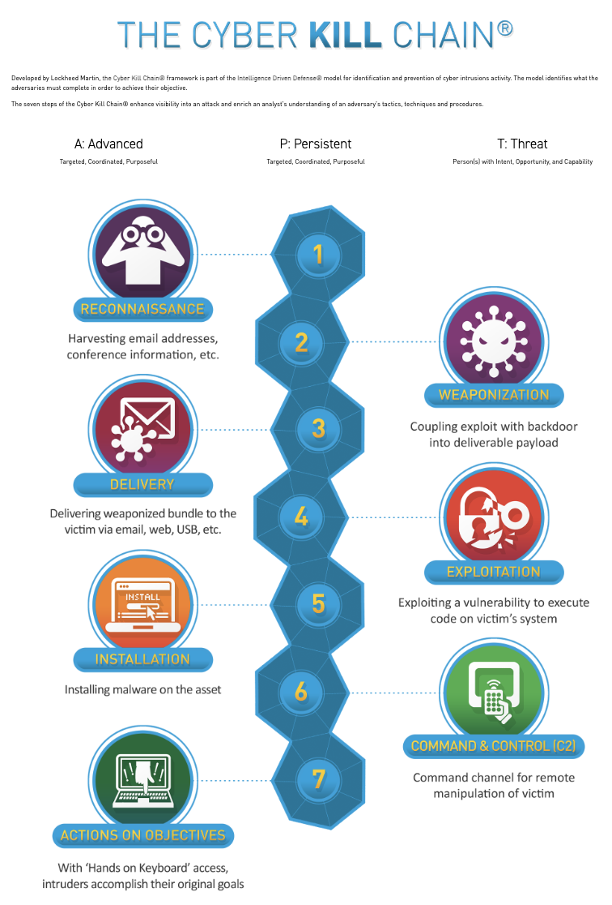
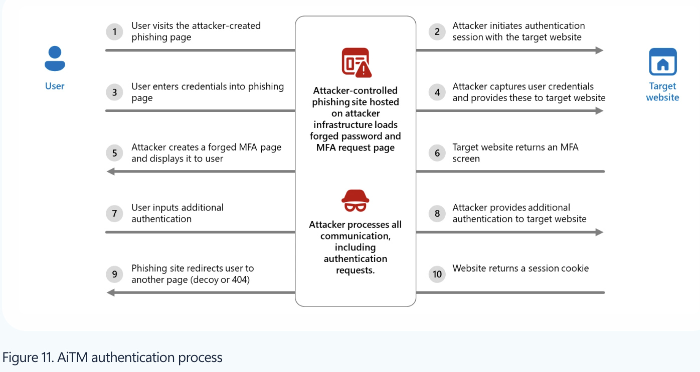
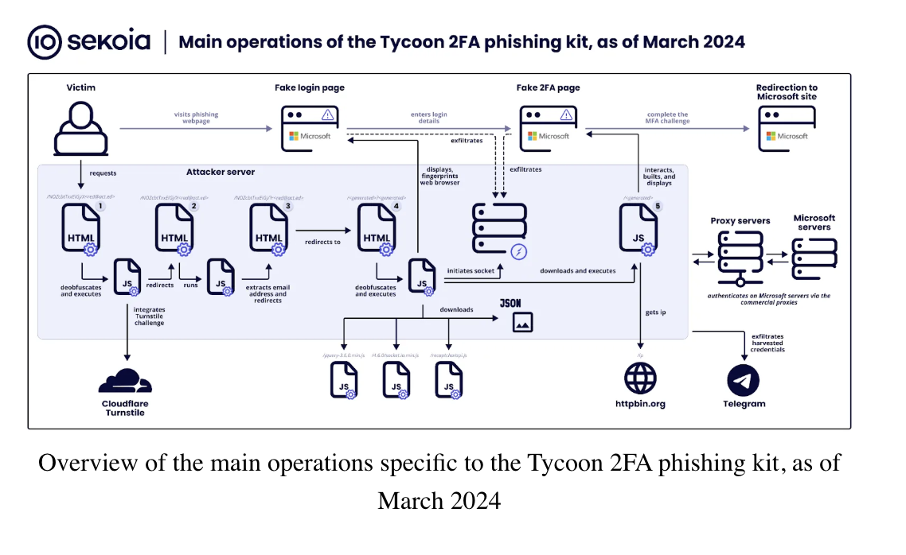
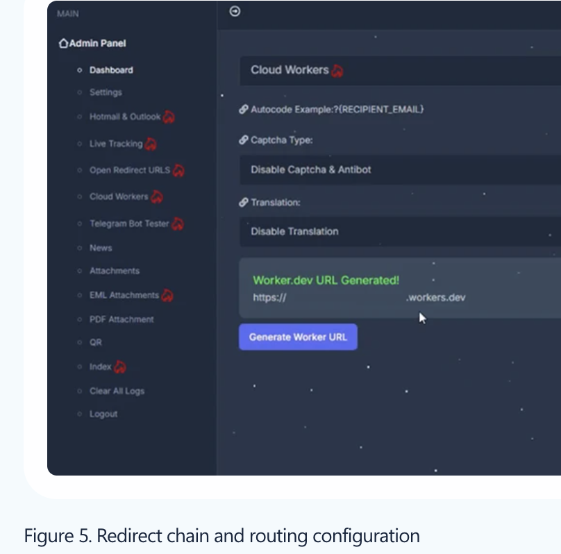
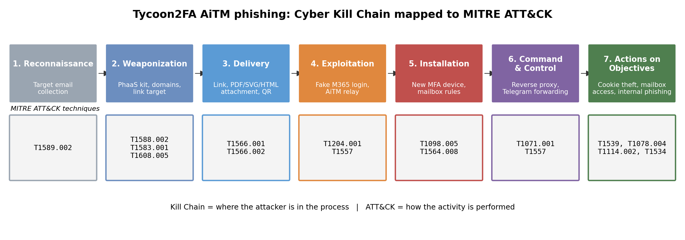
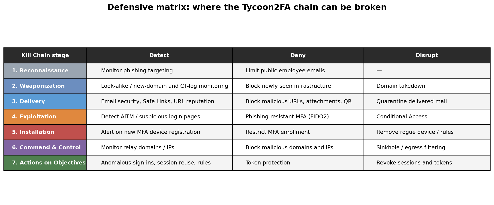

# Week 4 — The Cyber Kill Chain

**Project:** Cyber Threat Intelligence Analysis of Phishing Infrastructure  
**Case study:** Tycoon2FA AiTM Phishing-as-a-Service  
**Frameworks:** Lockheed Martin Cyber Kill Chain and MITRE ATT&CK  

| What we produced | File |
|---|---|
| Seven-stage analysis of the Tycoon2FA phishing operation | This report |
| Cyber Kill Chain diagram | `image/cyber-kill-chain.png` |
| Tycoon2FA AiTM attack-flow diagram | `image/tycoon2fa-aitm-flow.png` |
| Phishing-page demonstration | `image/tycoon2fa-phishing-page.png` |
| Redirect / infrastructure demonstration | `image/tycoon2fa-redirect-chain.png` |
| Kill Chain → MITRE ATT&CK mapping | Section 5 |
| IOC → Kill Chain relationship | Section 6 |
| Defensive analysis and attack breakpoints | Section 7 |

---

## 1. Introduction

### 1.1 Lockheed Martin Cyber Kill Chain

The Cyber Kill Chain is a model developed by Lockheed Martin as part of its Intelligence Driven Defense approach.

The model describes a cyber intrusion through seven stages:

| # | Stage | Attacker goal |
|---|---|---|
| 1 | Reconnaissance | Identify and study potential targets |
| 2 | Weaponization | Prepare the infrastructure, malicious content, or attack capability |
| 3 | Delivery | Deliver the malicious content to the victim |
| 4 | Exploitation | Trigger malicious activity through exploitation or user interaction |
| 5 | Installation | Establish persistence or maintain a foothold |
| 6 | Command & Control | Maintain communication with attacker-controlled infrastructure |
| 7 | Actions on Objectives | Achieve the final objective of the attack |

The Cyber Kill Chain is intended to improve visibility into an intrusion and help defenders identify points where an attack can be detected or disrupted. 



*Figure 1. Seven stages of the Lockheed Martin Cyber Kill Chain.*

**Source:** [Lockheed Martin — Cyber Kill Chain](https://www.lockheedmartin.com/en-us/capabilities/cyber/cyber-kill-chain.html)

### 1.2 Why map the attack to MITRE ATT&CK?

The Cyber Kill Chain provides a high-level and mostly sequential representation of an intrusion.

MITRE ATT&CK provides more detailed tactics, techniques, and sub-techniques describing how adversaries perform specific actions.

In this project:

- **Cyber Kill Chain** is used to describe **where the attacker is in the attack lifecycle**.
- **MITRE ATT&CK** is used to describe **how the attacker performs the activity**.

The two frameworks are therefore complementary.

---

## 2. Selected Real-World Case — Tycoon2FA

Tycoon2FA is a Phishing-as-a-Service (PhaaS) platform that provides adversary-in-the-middle (AiTM) phishing capabilities.

Microsoft Threat Intelligence first observed Tycoon2FA in August 2023 and associated the platform with the threat actor tracked as **Storm-1747**. Microsoft reported that the service scaled to campaigns reaching more than 500,000 organizations per month and enabled large numbers of phishing attempts designed to bypass multifactor authentication. :contentReference[oaicite:2]{index=2}

Unlike a traditional credential-harvesting page, Tycoon2FA can operate as a reverse proxy between the victim and the legitimate identity provider.

The attack can therefore:

- display a fake Microsoft 365 or Google login page;
- relay credentials to the legitimate authentication service;
- relay the real MFA challenge to the victim;
- capture the resulting authenticated session token or cookie;
- allow the attacker to reuse the authenticated session.

Sekoia and Elastic independently describe this reverse-proxy/AiTM architecture and the associated session-token theft. 

---

## 3. Attack Timeline

| Date | Event |
|---|---|
| August 2023 | Tycoon2FA first observed |
| October 2023 | Sekoia publicly analyzes the phishing kit |
| 2024 | Newer versions introduce stronger obfuscation and anti-analysis mechanisms |
| 2025 | The infrastructure continues to evolve with short-lived domains, redirects, CAPTCHA, and additional evasion features |
| 4 March 2026 | Microsoft and partners disrupt Tycoon2FA infrastructure and operations |
| March 2026 | Microsoft reports seizure of 330 active domains associated with the operation |
| April 2026 | eSentire reports adaptation of Tycoon2FA tradecraft to OAuth device-code phishing |

Microsoft reported that Tycoon2FA used fast-moving infrastructure, with many campaign-specific fully qualified domain names lasting only 24–72 hours. The March 2026 disruption targeted 330 active domains supporting the operation. 

---

## 4. How the Tycoon2FA Attack Works

The following sequence represents a simplified AiTM authentication flow:

```text
Phishing Email
       ↓
Malicious Link / Attachment / QR Code
       ↓
Redirect Chain
       ↓
CAPTCHA / Anti-Bot Check
       ↓
Fake Microsoft / Google Login Page
       ↓
Victim Enters Credentials
       ↓
Tycoon2FA Reverse Proxy
       ↓
Legitimate Identity Provider
       ↓
Real MFA Challenge
       ↓
Victim Completes MFA
       ↓
Session Token / Cookie Captured
       ↓
Attacker Reuses Authenticated Session
       ↓
Cloud Account Access
```

Tycoon2FA's reverse-proxy architecture is designed to relay the real authentication process rather than simply collecting a password. This allows the attacker to obtain authenticated session material after MFA has been completed.




*Figure 2. Simplified Tycoon2FA adversary-in-the-middle authentication flow.*

**Sources:** [Microsoft Threat Intelligence](https://www.microsoft.com/en-us/security/blog/2026/03/04/inside-tycoon2fa-how-a-leading-aitm-phishing-kit-operated-at-scale/) and [Sekoia](https://www.sekoia.io/blog/tycoon-2fa-an-in-depth-analysis-of-the-latest-version-of-the-aitm-phishing-kit).

---

# 5. Cyber Kill Chain Analysis

## Stage 1 — Reconnaissance

Reconnaissance is the stage where an attacker identifies potential victims and gathers information that can support targeting.

Tycoon2FA campaigns can be used at large scale, and public reporting describes targeting of organizations and users through phishing campaigns.

However, the exact reconnaissance process for a specific victim is generally not visible in public reporting.

**Evidence:** Campaign targeting and phishing activity are documented by Microsoft and other security researchers.

**Status:** Partially supported at campaign level; individual victim reconnaissance is not directly observed.

### MITRE ATT&CK

**T1589.002 — Gather Victim Identity Information: Email Addresses**

Email addresses can be collected and used as targets for phishing campaigns.

**Mapping status:** Analytical / partially supported.

---

## Stage 2 — Weaponization

Weaponization represents preparation of the capabilities required for the phishing operation.

Tycoon2FA provides reusable phishing infrastructure and functionality such as:

- phishing-page templates;
- authentication relay mechanisms;
- redirect logic;
- CAPTCHA and anti-bot checks;
- configurable phishing domains;
- brand impersonation;
- session-token theft.

The platform therefore reduces the technical effort required for an operator to conduct an AiTM phishing campaign.

**Evidence:** Microsoft and Sekoia document reusable Tycoon2FA phishing infrastructure and its technical capabilities. :contentReference[oaicite:6]{index=6}

**Status:** Supported at campaign level.

### MITRE ATT&CK

**T1588.002 — Obtain Capabilities: Tool**

The operator obtains ready-made tooling instead of developing the complete phishing capability independently.

**T1583.001 — Acquire Infrastructure: Domains**

Attackers acquire domains to host or support malicious activity.

**T1608.005 — Stage Capabilities: Link Target**

Attack infrastructure can be prepared as the target of malicious links.

---

## Stage 3 — Delivery

Delivery is the stage where malicious content reaches the victim.

Tycoon2FA campaigns have used several delivery mechanisms, including:

- phishing links;
- QR codes;
- PDF attachments;
- DOC/DOCX attachments;
- SVG attachments;
- HTML attachments.

Microsoft reports that the kit could support multiple phishing delivery methods and redirect the victim through intermediate infrastructure before presenting the phishing page. 




*Figure 3. Example of a Tycoon2FA phishing / authentication page.*

### MITRE ATT&CK

**T1566.001 — Phishing: Spearphishing Attachment**

Relevant when a malicious attachment is used to deliver the phishing operation.

**T1566.002 — Phishing: Spearphishing Link**

Relevant when a phishing link is delivered to the victim.

**Status:** Directly supported by the documented Tycoon2FA delivery methods.

---

## Stage 4 — Exploitation

In this attack, exploitation does not primarily depend on a software vulnerability.

Instead, the attack exploits **user trust and the authentication process**.

The victim is presented with a convincing login page and interacts with it as if it were legitimate.

The real authentication process is then relayed through attacker-controlled infrastructure.

The victim may:

1. enter the username;
2. enter the password;
3. receive the legitimate MFA prompt;
4. approve the MFA request;
5. unknowingly provide the attacker with authenticated session material.

### MITRE ATT&CK

**T1204.001 — User Execution: Malicious Link**

The victim interacts with the phishing link and initiates the malicious workflow.

**T1557 — Adversary-in-the-Middle**

The attacker positions infrastructure between the victim and legitimate services to intercept authentication information and session material. MITRE explicitly documents AiTM as a technique that can support credential and session-cookie theft. :contentReference[oaicite:8]{index=8}

**Status:** Directly supported by the documented Tycoon2FA architecture.

---

## Stage 5 — Installation

Traditional Kill Chain analysis associates Installation with placing malware or establishing persistence on a victim device.

Tycoon2FA is different because the primary attack does not require endpoint malware installation.

Instead, persistence can be established in the **cloud identity environment**.

Attackers using this type of infrastructure may:

- register an additional authentication method or device;
- maintain stolen sessions;
- create mailbox rules;
- retain access to cloud resources.

Elastic specifically describes detection of unusual device registration associated with Tycoon2FA and identifies the identity-persistence step as an important part of the attack chain.

### MITRE ATT&CK

**T1098.005 — Account Manipulation: Device Registration**

A new device or authenticator can be registered to maintain access to an account.

**T1564.008 — Hide Artifacts: Email Hiding Rules**

Mailbox rules can be used to conceal attacker-related messages and reduce the chance of discovery.

**Status:** Supported at campaign level.

These behaviors are not required for every Tycoon2FA campaign. They are treated here as possible post-compromise persistence or defense-evasion actions.

### Interpretation

This stage shows one limitation of applying a traditional endpoint-oriented Kill Chain to modern cloud identity attacks.

For an AiTM phishing operation, persistence can exist in the identity layer rather than as a file or service installed on the endpoint.

---

## Stage 6 — Command & Control

Command & Control represents communication with attacker-controlled infrastructure.

Tycoon2FA uses an attacker-controlled reverse proxy to relay authentication traffic between the victim and the legitimate identity provider.

The kit can use web communication and real-time bidirectional communication to relay authentication requests and responses.

Sekoia documented WebSocket-based communication in Tycoon2FA, while Elastic identified server-side authentication activity associated with Node.js-style user agents such as `axios`, `node`, and `undici`. 

Captured session information can also be forwarded to operator-controlled infrastructure for further use. 

### MITRE ATT&CK

**T1071.001 — Application Layer Protocol: Web Protocols**

Web protocols can be used for communication between malicious infrastructure and services.

**T1557 — Adversary-in-the-Middle**

The reverse proxy maintains the attacker's position between the victim and the legitimate service.

**Status:** Supported by the technical architecture described by Microsoft, Sekoia, and Elastic.

---

## Stage 7 — Actions on Objectives

The final stage represents what the attacker wants to accomplish after obtaining access.

For Tycoon2FA, the main objective is unauthorized access to cloud identities and the information available through those accounts.

Potential post-compromise actions include:

- reusing stolen session cookies;
- accessing cloud accounts;
- reading email;
- creating mailbox rules;
- registering additional authentication devices;
- sending follow-on phishing messages;
- conducting business email compromise and other account-abuse activity.

Microsoft reports that Tycoon2FA enabled attackers to maintain access to accounts through stolen session cookies even after password changes unless active sessions and tokens were revoked. 

### MITRE ATT&CK

**T1539 — Steal Web Session Cookie**

Session cookies can be stolen and reused to authenticate to web applications. MITRE explicitly identifies malicious proxy frameworks as a way of capturing session cookies. 

**T1078.004 — Valid Accounts: Cloud Accounts**

Stolen authenticated access can be used to access cloud accounts and SaaS services.

**T1114.002 — Email Collection: Remote Email Collection**

Cloud mailbox data can be accessed after account compromise.

**T1564.008 — Hide Artifacts: Email Hiding Rules**

Mailbox rules can conceal attacker-related messages.

**T1534 — Internal Spearphishing**

A compromised account can be used to send additional phishing messages inside an organization.

**Status:** Supported at campaign level.

---

# 6. Cyber Kill Chain and MITRE ATT&CK Mapping

| Kill Chain Stage | Observed / Documented Activity | MITRE ATT&CK | Status |
|---|---|---|---|
| **Reconnaissance** | Identification of potential phishing targets | T1589.002 | Partially supported |
| **Weaponization** | PhaaS tooling, domains, phishing templates and link infrastructure | T1588.002, T1583.001, T1608.005 | Supported |
| **Delivery** | Phishing links, attachments and QR-based delivery | T1566.001, T1566.002 | Directly supported |
| **Exploitation** | User interaction and AiTM authentication relay | T1204.001, T1557 | Directly supported |
| **Installation** | Cloud identity persistence and mailbox manipulation | T1098.005, T1564.008 | Campaign-level evidence |
| **Command & Control** | Reverse proxy and web communication | T1071.001, T1557 | Supported |
| **Actions on Objectives** | Session-cookie theft, cloud-account access, email collection and internal phishing | T1539, T1078.004, T1114.002, T1564.008, T1534 | Campaign-level evidence |



*Figure 4. Project-authored mapping of Tycoon2FA behavior to MITRE ATT&CK techniques.*

The mappings above are analytical comparisons between the documented Tycoon2FA behavior and official ATT&CK definitions. They are not presented as an official one-to-one mapping published by MITRE.

---

# 7. IOC and Kill Chain Relationship

The previous project weeks focused on collecting and organizing phishing infrastructure indicators.

Week 2 established the OSINT collection workflow.

Week 3 normalized IOC data and imported indicators into MISP.

Week 4 adds attack-stage context to those indicators.

| Kill Chain Stage | Related CTI Data |
|---|---|
| Reconnaissance | Target email addresses |
| Weaponization | Phishing domains and infrastructure |
| Delivery | Phishing URLs and attachments |
| Exploitation | Fake login domains and AiTM infrastructure |
| Installation | MFA/device-registration and mailbox changes |
| Command & Control | Relay domains, IP addresses and web infrastructure |
| Actions on Objectives | Session cookies, cloud accounts and mailbox activity |

The complete workflow is:

```text
IOC Collection
      ↓
OSINT Enrichment
      ↓
Normalization
      ↓
MISP Correlation
      ↓
Cyber Kill Chain
      ↓
MITRE ATT&CK TTP
      ↓
Detection and Mitigation
```

This demonstrates how a phishing-related IOC can be interpreted not only as an isolated domain or IP address, but as part of a larger adversary workflow.

---

# 8. Defensive Analysis

The Lockheed Martin model can also be used to identify points where defenders can detect, deny, disrupt, degrade, deceive, or destroy attacker activity. :contentReference[oaicite:14]{index=14}

| Kill Chain Stage | Detection | Defensive Action |
|---|---|---|
| **Reconnaissance** | Monitor phishing targeting and exposed employee information | Reduce unnecessary exposure of employee addresses |
| **Weaponization** | Monitor newly registered domains and phishing infrastructure | Block or investigate suspicious domains |
| **Delivery** | Email security, URL filtering, attachment analysis | Block malicious URLs and phishing attachments |
| **Exploitation** | Detect AiTM indicators and suspicious login flows | Use phishing-resistant MFA such as FIDO2/passkeys |
| **Installation** | Monitor unusual MFA/device registration | Restrict unauthorized device registration |
| **C2** | Monitor relay domains, IPs and suspicious authentication traffic | Block malicious infrastructure and suspicious web traffic |
| **Actions on Objectives** | Detect unusual cloud sign-ins, mailbox rules and session reuse | Revoke active sessions/tokens and remove malicious changes |

Microsoft's remediation guidance includes phishing-resistant MFA, revoking active sessions and tokens, removing unauthorized MFA devices, and removing malicious inbox rules. 



*Figure 5. Project-authored defensive mapping across the Kill Chain.*

---

# 9. Kill Chain vs MITRE ATT&CK

| | Cyber Kill Chain | MITRE ATT&CK |
|---|---|---|
| Structure | Seven high-level stages | Tactics, techniques and sub-techniques |
| Main purpose | Explain attack progression | Describe detailed adversary behavior |
| Best for | Attack narrative and defensive planning | Threat hunting and detection engineering |
| Strength | Simple and easy to communicate | More detailed and technically precise |
| Limitation | Linear model is less suitable for cloud identity attacks | More complex and requires prioritization |
| Tycoon2FA application | Organizes phishing → compromise → post-compromise activity | Describes phishing, AiTM, cookie theft, cloud persistence and account abuse |

The Tycoon2FA case demonstrates why both frameworks are useful.

The Kill Chain explains the overall progression of the operation, while ATT&CK makes it possible to describe specific attacker techniques.

---

# 10. Limitations

This analysis has several limitations:

- Tycoon2FA is a PhaaS platform used by multiple operators, so not every technique is present in every individual campaign.
- Public reports often describe platform capabilities and observed campaign patterns rather than one complete victim timeline.
- Individual reconnaissance activity is generally not visible.
- “Installation” required adaptation of the traditional Kill Chain because persistence can occur in cloud identity infrastructure instead of endpoint malware.
- Some ATT&CK mappings therefore describe campaign-level behavior rather than direct observation of one specific victim.
- The phishing sample investigated in Weeks 2–3 was **not** assumed to be Tycoon2FA infrastructure.
- No malicious Tycoon2FA URL was opened or executed during this project.
- IOC data represents observations available from public intelligence sources at the time of analysis.
- Public threat-intelligence services may change their results as new information becomes available.

---

# 11. Connection to Previous Weeks

### Week 1 — CTI Fundamentals

Week 1 established:

- CTI terminology;
- phishing threat classification;
- IOC concepts;
- relevant threat-intelligence sources.

### Week 2 — Data Collection Process

Week 2 collected and investigated:

- phishing URLs;
- domains;
- IP addresses;
- registration data;
- reputation information;
- infrastructure relationships.

### Week 3 — Data Processing and Exploitation

Week 3:

- filtered and normalized IOC data;
- created a structured IOC dataset;
- deployed MISP locally;
- imported phishing indicators;
- demonstrated enrichment and correlation.

### Week 4 — Cyber Kill Chain

Week 4 adds behavioral context:

```text
CTI
 ↓
IOC
 ↓
Infrastructure
 ↓
MISP
 ↓
Kill Chain Stage
 ↓
MITRE ATT&CK Technique
 ↓
Defensive Control
```

This creates a continuous project workflow from threat intelligence collection to adversary behavior analysis.

---

# 12. Conclusion

The Tycoon2FA case demonstrates how the Cyber Kill Chain can be applied to a modern phishing-as-a-service operation.

The attack begins with preparation of phishing infrastructure and delivery through links, attachments, or QR codes. The victim is then directed to a fraudulent authentication page where the attacker uses an adversary-in-the-middle architecture to relay the legitimate authentication process.

After the victim completes MFA, the attacker can obtain authenticated session material and continue with cloud-account access, identity persistence, mailbox manipulation, and follow-on phishing.

The Cyber Kill Chain provides a high-level view of this progression, while MITRE ATT&CK provides a detailed technical description of the behaviors involved.

For this project, combining:

```text
IOC Collection
      ↓
OSINT Enrichment
      ↓
MISP
      ↓
Correlation
      ↓
Cyber Kill Chain
      ↓
MITRE ATT&CK
      ↓
Defensive Analysis
```

allows phishing infrastructure to be connected with attacker behavior and defensive opportunities.

The main lesson is that phishing infrastructure should not be analyzed only as a list of malicious domains and URLs. Those indicators gain significantly more value when they are connected to the attack stage, adversary technique, and appropriate defensive control.

---

# 13. AI Assistance Disclosure

AI tools were used as a supporting assistant during the preparation of this weekly increment.

AI assistance was used for:

- organizing the report structure;
- helping compare the Cyber Kill Chain with MITRE ATT&CK;
- improving documentation and Markdown formatting;
- helping summarize cited sources;
- assisting with the presentation of the attack flow and defensive analysis.

The factual claims in this report are based on the cited Lockheed Martin, Microsoft, Sekoia, Elastic, and MITRE ATT&CK sources.

AI was not treated as an independent source of threat intelligence, and no AI-generated claim was intentionally presented as direct experimental evidence.

---

# 14. References

1. Lockheed Martin — **Cyber Kill Chain**  
   https://www.lockheedmartin.com/en-us/capabilities/cyber/cyber-kill-chain.html

2. Lockheed Martin — **Seven Ways to Apply the Cyber Kill Chain with a Threat Intelligence Platform**  
   https://www.lockheedmartin.com/content/dam/lockheed-martin/rms/documents/cyber/Seven_Ways_to_Apply_the_Cyber_Kill_Chain_with_a_Threat_Intelligence_Platform.pdf

3. Microsoft Threat Intelligence — **Inside Tycoon2FA: How a leading AiTM phishing kit operated at scale**  
   https://www.microsoft.com/en-us/security/blog/2026/03/04/inside-tycoon2fa-how-a-leading-aitm-phishing-kit-operated-at-scale/

4. Microsoft — **Defending the gates: How a global coalition disrupted Tycoon 2FA**  
   https://blogs.microsoft.com/on-the-issues/2026/03/04/how-a-global-coalition-disrupted-tycoon/

5. Sekoia — **Tycoon 2FA: An in-depth analysis of the latest version of the AiTM phishing kit**  
   https://www.sekoia.io/blog/tycoon-2fa-an-in-depth-analysis-of-the-latest-version-of-the-aitm-phishing-kit

6. Elastic Security Labs — **Detecting Tycoon 2FA AiTM attacks across Entra ID and Google Workspace**  
   https://www.elastic.co/security-labs/threat-command/tycoon-2fa-aitm-detection-engineering

7. Cloudflare — **Tycoon 2FA Takedown**  
   https://www.cloudflare.com/threat-intelligence/research/report/tycoon-2fa-takedown/

8. eSentire — **Tycoon 2FA Operators Adopt OAuth Device Code Phishing**  
   https://www.esentire.com/blog/tycoon-2fa-operators-adopt-oauth-device-code-phishing

9. MITRE ATT&CK — **Phishing (T1566)**  
   https://attack.mitre.org/techniques/T1566/

10. MITRE ATT&CK — **User Execution (T1204)**  
    https://attack.mitre.org/techniques/T1204/

11. MITRE ATT&CK — **Adversary-in-the-Middle (T1557)**  
    https://attack.mitre.org/techniques/T1557/

12. MITRE ATT&CK — **Steal Web Session Cookie (T1539)**  
    https://attack.mitre.org/techniques/T1539/

13. MITRE ATT&CK — **Valid Accounts: Cloud Accounts (T1078.004)**  
    https://attack.mitre.org/techniques/T1078/004/

14. MITRE ATT&CK — **Account Manipulation: Device Registration (T1098.005)**  
    https://attack.mitre.org/techniques/T1098/005/

15. MITRE ATT&CK — **Hide Artifacts: Email Hiding Rules (T1564.008)**  
    https://attack.mitre.org/techniques/T1564/008/

16. MITRE ATT&CK — **Email Collection: Remote Email Collection (T1114.002)**  
    https://attack.mitre.org/techniques/T1114/002/

17. MITRE ATT&CK — **Internal Spearphishing (T1534)**  
    https://attack.mitre.org/techniques/T1534/

---

# 15. Weekly Deliverables Checklist

- [x] Lockheed Martin Cyber Kill Chain reviewed
- [x] Seven Kill Chain stages described
- [x] Real-world phishing operation selected
- [x] Tycoon2FA attack flow analyzed
- [x] Each Kill Chain stage mapped to relevant ATT&CK techniques where supported
- [x] Evidence limitations documented
- [x] IOC and Kill Chain relationship documented
- [x] Defensive breakpoints identified
- [x] Cyber Kill Chain and MITRE ATT&CK compared
- [x] Connection to Weeks 1–3 documented
- [x] References added
