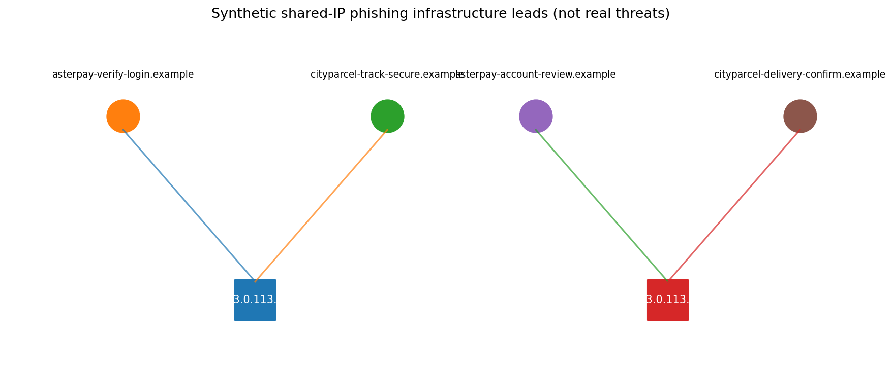
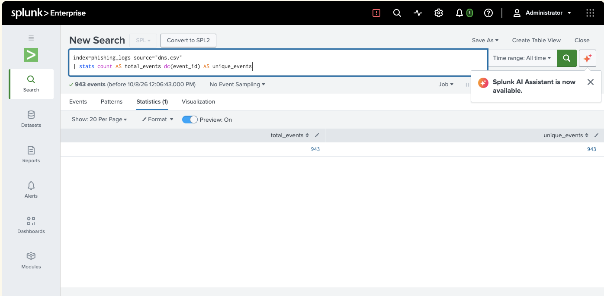
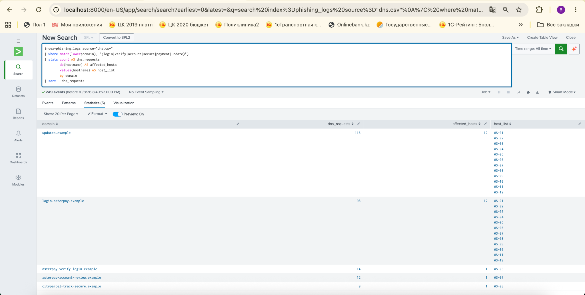
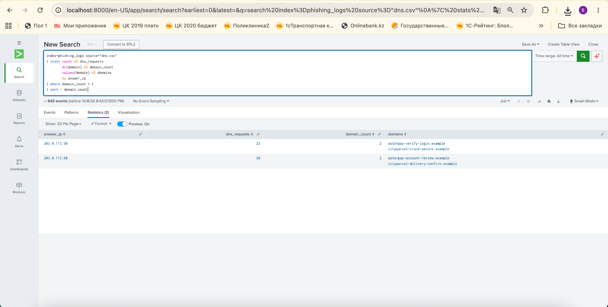
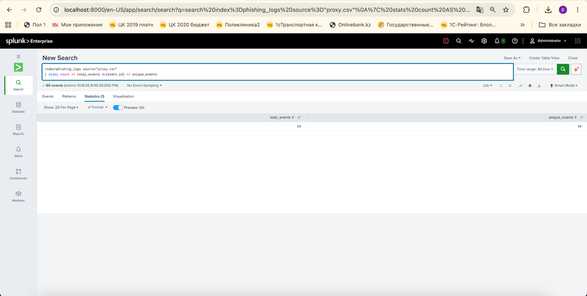
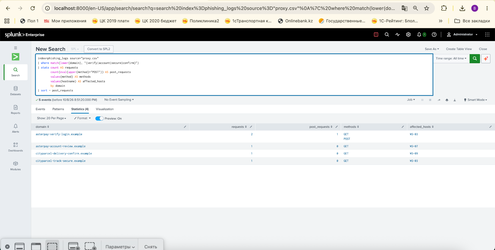
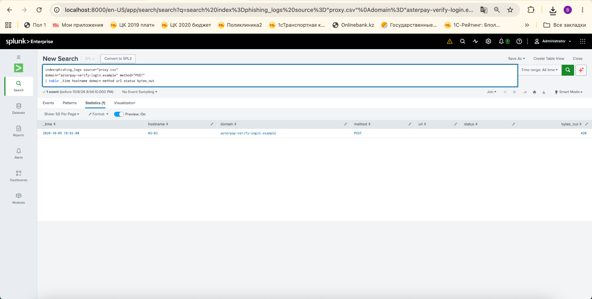
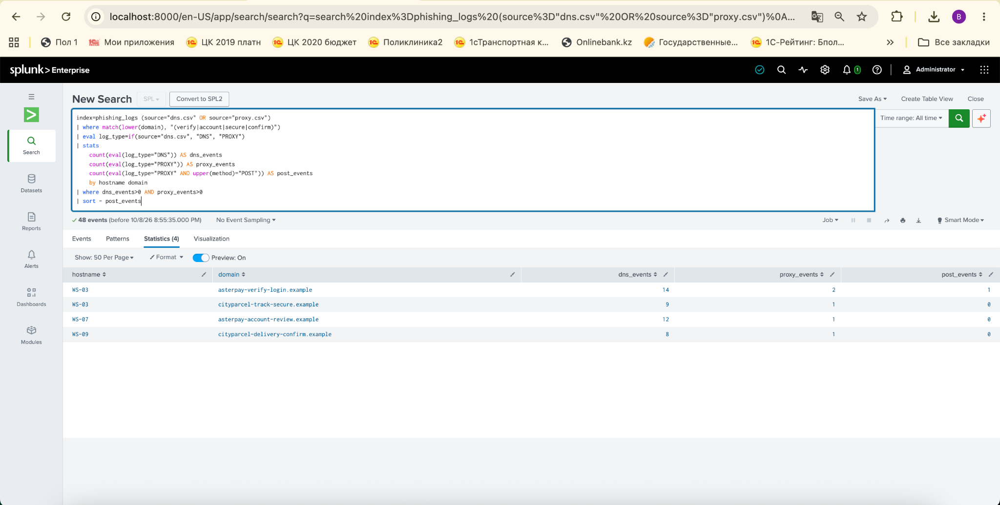

# Week 5 — Threat Hunting Concept

**Group project:** Cyber Threat Intelligence Analysis of Phishing Infrastructure  
**Course:** Astana IT University, 2026–2027 · Section 3.3, Week 5  
**Members:** Kurmangaliyeva A., Saduakhassova A. · **Group:** CS-2417  
**Status:** Splunk Enterprise searches executed on the synthetic DNS and proxy CSVs; screenshots of actual Splunk query results are bundled. No production logs, attacks, or live phishing feeds were tested.

## 1. Week 5 assignment alignment

| Required task | This submission |
|---|---|
| Compare intelligence-driven and hypothesis-driven hunting | Section 2 |
| Develop a hypothesis-driven scenario for the team's topic | Section 3 |
| Execute queries in Splunk or ELK | Five core investigative searches were executed in Splunk; see Section 5 and `screenshots/`. The original query reference files are also included |
| Present findings and limitations | Sections 5–7; independent local analysis completed |
| Document weekly progress on GitHub | Commit instructions in `SETUP.md`; no remote commits claimed |
| Defend in 7–8 minutes | `DEFENSE.md` |

## 2. Hunting models

- **Intel-driven hunting:** start from existing IOCs (known malicious domains or IP addresses), then search DNS/proxy records for matches. This is fast for known infrastructure but may miss new domains.
- **Hypothesis-driven hunting:** propose attacker behavior, specify data that would reveal it, perform queries, then review and validate candidate events. This can surface unknown infrastructure but produces false positives.

Our lab uses hypothesis-driven hunting as the main approach and introduces an allowlist/baseline as a form of intelligence enrichment. No live external threat feed was queried.

## 3. Our investigation and hypothesis

**H1: Brand-like phishing infrastructure.** Simulated clients may query domains resembling trusted fictional services (`asterpay.example` and `cityparcel.example`) that are *not* the trusted domain or its actual subdomain.

**H2: Web activity for an H1 candidate.** A client may make an HTTP POST to a candidate domain. This is a triage signal; **HTTP POST does not prove credential disclosure**.

**H3: Infrastructure correlation.** Multiple H1 domains may share an answer IP, suggesting common hosting or routing. Shared IP alone does not prove common ownership or malicious coordination.

**H0 intel baseline:** Compare candidate domains with known verified indicators, if a relevant verified feed is available. In this standalone exercise, the four planted suspicious domains are *simulation labels*, not independently verified threat intelligence; H0 cannot be honestly reported as a live intel-feed match.

**MITRE ATT&CK links:** T1583.001 (Acquire Infrastructure: Domains) and T1566.002 (Spearphishing Link). These describe relevant possible attacker behaviors, not proof that those techniques occurred in the lab.

## 4. Data and provenance

- `data/dns.csv`: **943** synthetic DNS records; 12 fictional workstations.
- `data/proxy.csv`: **60** synthetic proxy records.
- Timestamps: UTC; start 2026-10-05 08:00Z.
- All domains are fictional under the reserved `.example` namespace; IP addresses use RFC 5737 documentation blocks (`192.0.2.0/24`, `198.51.100.0/24`, `203.0.113.0/24`). **No phishing services were contacted, no real credentials were entered, and no attack was executed.**
- The generator is deterministic (`scripts/generate_data.py`). `scenario_label` is synthetic ground truth to help teaching and **must not be used as a hunting feature**.
- Splunk uses raw CSV fields and example `sourcetype=phish_dns` / `sourcetype=phish_proxy`. Elastic assumes keyword-mapped fields in `phish-dns` and `phish-proxy`.

| Field | Meaning |
|---|---|
| `timestamp` | Synthetic event time in UTC |
| `event_id` | Unique input row ID |
| `hostname` | Fictional workstation |
| `domain` | DNS question name or proxy destination |
| `answer_ip` | Invented DNS answer |
| `method`, `url_path`, `bytes_out` | Available only in proxy log |

## 5. Executed Splunk searches and evidence

The team uploaded `data/dns.csv` and `data/proxy.csv` into the `phishing_logs` index with CSV extraction and executed Splunk searches using **All time**. The seven captured Splunk screens below are from the documented local lab execution. The accompanying `queries/executed_splunk_queries.spl` preserves those exact query texts, one search per block. The earlier `queries/splunk_hunts.spl` and `queries/elastic_hunts.esql` are reference implementations that are **not claimed to have been executed** in this run. Independent Python analysis also produced `results/hunt_results.json`.

### Q0 — Data quality

**Locally confirmed:** 943 DNS events, 943 unique DNS event IDs, 60 proxy events, 60 unique proxy IDs, 12 distinct hosts.

### Q1 — Potential brand lookalikes

**Locally observed:** six candidate domain names matched the intentionally broad pattern. Four are planted phishing-like scenarios, and **two are benign lookalike controls**:

| Candidate domain | DNS requests | Lab context |
|---|---:|---|
| `asterpay-help.example` | 22 | Benign-looking control |
| `cityparcel-archive.example` | 21 | Benign-looking control |
| `asterpay-verify-login.example` | 14 | Planted suspicious scenario |
| `asterpay-account-review.example` | 12 | Planted suspicious scenario |
| `cityparcel-track-secure.example` | 9 | Planted suspicious scenario |
| `cityparcel-delivery-confirm.example` | 8 | Planted suspicious scenario |

**Interpretation:** the detector returns leads, not six confirmed malicious domains. A keyword match is insufficient; the benign controls demonstrate why triage is essential.

### Q2 — Which endpoints queried the candidates?

In the planted scenarios, `WS-03`, `WS-07` and `WS-09` queried the four suspicious-example domains. Benign controls were queried by many hosts. This distribution is useful investigation context, **not** a general detection rule.

### Q3 — POST to candidate domain

**Locally observed:** one synthetic POST from `WS-03` to `asterpay-verify-login.example` at `/session`, `bytes_out=420`. The payload is not recorded. The result **cannot establish** whether credentials, test data or other content was submitted.

### Q4 — Shared infrastructure leads

**Locally observed:**

- `203.0.113.50`: `asterpay-verify-login.example` and `cityparcel-track-secure.example`.
- `203.0.113.60`: `asterpay-account-review.example` and `cityparcel-delivery-confirm.example`.

These are fabricated shared DNS answers designed to illustrate an infrastructure correlation investigation. The two domain pairs are illustrated in `images/infrastructure_graph.png`.



**Important:** This is a locally generated diagram, not a screenshot from Splunk or Kibana. To satisfy the practical requirement, add your own actual screenshots to `screenshots/` after executing the searches.

### Search S1 — Verify DNS CSV ingestion

```spl
index=phishing_logs source="dns.csv"
| stats count AS total_events dc(event_id) AS unique_events
```

**Observed Splunk result:** `total_events=943`, `unique_events=943`.



*Figure 1. Actual Splunk search showing 943 indexed DNS events with 943 distinct event IDs.*

### Search S2 — Broad hypothesis-driven keyword hunt

```spl
index=phishing_logs source="dns.csv"
| where match(lower(domain), "(login|verify|account|secure|payment|update)")
| stats count AS dns_requests dc(hostname) AS affected_hosts values(hostname) AS host_list by domain
| sort - dns_requests
```

**Observed Splunk result:** 249 matching DNS events, grouped into five domains.

| Domain | DNS requests | Hosts | Triage |
|---|---:|---:|---|
| `updates.example` | 116 | 12 | Baseline service in this synthetic scenario |
| `login.asterpay.example` | 98 | 12 | Trusted subdomain in this scenario |
| `asterpay-verify-login.example` | 14 | 1 | Review candidate |
| `asterpay-account-review.example` | 12 | 1 | Review candidate |
| `cityparcel-track-secure.example` | 9 | 1 | Review candidate |

This broad search deliberately matches legitimate terms too. The `cityparcel-delivery-confirm.example` domain is **not covered by this search's keywords**, so it appears in the later correlation but not in S2. This is a demonstrated scope limitation of keyword hunting.



*Figure 2. Five grouped domain results from a broad keyword search.*

### Search S3 — Domains sharing DNS answer IPs

```spl
index=phishing_logs source="dns.csv"
| stats count AS dns_requests dc(domain) AS domain_count values(domain) AS domains by answer_ip
| where domain_count > 1
| sort - domain_count
```

**Observed Splunk result:** two shared IP groups, involving four distinct domains and 43 DNS requests:

| Documentation IP | Domains | Requests |
|---|---|---:|
| `203.0.113.50` | `asterpay-verify-login.example`; `cityparcel-track-secure.example` | 23 |
| `203.0.113.60` | `asterpay-account-review.example`; `cityparcel-delivery-confirm.example` | 20 |



*Figure 3. Two shared-IP groups in the teaching dataset. Shared hosting does not imply shared attacker ownership.*

### Search S4 — Verify proxy CSV ingestion

```spl
index=phishing_logs source="proxy.csv"
| stats count AS total_events dc(event_id) AS unique_events
```

**Observed Splunk result:** `total_events=60`, `unique_events=60`.



*Figure 4. Actual proxy data ingestion validation.*

### Search S5 — Web activity to candidates

```spl
index=phishing_logs source="proxy.csv"
| where match(lower(domain), "(verify|account|secure|confirm)")
| stats count AS requests count(eval(upper(method)="POST")) AS post_requests values(method) AS methods values(hostname) AS affected_hosts by domain
| sort - post_requests
```

**Observed Splunk result:** five proxy requests to four candidate domains; one HTTP POST from `WS-03` to `asterpay-verify-login.example`. The other requests use GET. HTTP method alone cannot reveal form contents.



*Figure 5. Four grouped domains, one POST event.*

### Search S6 — Inspect the POST event

```spl
index=phishing_logs source="proxy.csv" domain="asterpay-verify-login.example" method="POST"
| table _time hostname domain method url status bytes_out
```

**Observed Splunk result:** 2026-10-05 10:03:00 as displayed in Splunk, `WS-03`, `POST`, `bytes_out=420`. The `url` and `status` columns are blank for this imported record; do not infer an HTTP response or transmitted credentials from them. The CSV has the field `url_path`, not `url`.



*Figure 6. A synthetic POST record with 420 outgoing bytes.*

### Search S7 — Co-occurrence of DNS and proxy events

```spl
index=phishing_logs (source="dns.csv" OR source="proxy.csv")
| where match(lower(domain), "(verify|account|secure|confirm)")
| eval log_type=if(source="dns.csv", "DNS", "PROXY")
| stats count(eval(log_type="DNS")) AS dns_events count(eval(log_type="PROXY")) AS proxy_events count(eval(log_type="PROXY" AND upper(method)="POST")) AS post_events by hostname domain
| where dns_events>0 AND proxy_events>0
| sort - post_events
```

**Observed Splunk result:** four matching host-domain pairs with a total of 43 DNS records and five proxy records:

| Host | Domain | DNS | Proxy | POST |
|---|---|---:|---:|---:|
| WS-03 | `asterpay-verify-login.example` | 14 | 2 | 1 |
| WS-03 | `cityparcel-track-secure.example` | 9 | 1 | 0 |
| WS-07 | `asterpay-account-review.example` | 12 | 1 | 0 |
| WS-09 | `cityparcel-delivery-confirm.example` | 8 | 1 | 0 |

This query groups by host and domain but **does not require DNS to precede proxy activity**. The results are co-occurrence, not a confirmed causal chain.



*Figure 7. Four matching host-domain groups in synthetic DNS and proxy records.*

## 6. Analysis and validation

1. **Hypothesis H1: supported as a synthetic candidate-finding exercise**, because the query retrieves the four planted suspicious examples. Its two benign controls show false positives in this designed sample; this is not a real-world false-positive rate.
2. **H2: observed POST to a candidate**, not proof of phishing success or account compromise.
3. **H3: observed two shared-IP domain pairs**, not proof of coordinated attacker ownership.
4. **H0: not performed against a live threat feed**, and no unverified indicator is called confirmed malicious.

### Limitations

- Synthetic records were authored for this task; detection metrics cannot be generalized to live networks.
- Keyword matching misses homoglyphs, many typosquats and unbranded phishing domains.
- Domains with brand terms can be legitimate; trusted-domain allowlisting needs maintenance.
- Shared IPs can be routine on hosting providers/CDNs.
- DNS does not prove a page was opened; proxy POST does not prove what was submitted.
- Splunk searches were executed and screenshot evidence recorded; however, this remains a **synthetic-data demonstration**, not evidence of a production phishing incident.

### Next increment

Extend the current searches with explicit timing constraints, false-positive review and passive CTI enrichment if suitable vetted sources become available. Do not visit suspected phishing sites or submit data.

## 7. Reproduction

See [`SETUP.md`](SETUP.md). Locally:

```bash
python3 scripts/generate_data.py
python3 scripts/hunt.py
python3 scripts/test_hunt.py
```

For the executed Splunk workflow, consult `queries/executed_splunk_queries.spl` and Figures 1–7 in `screenshots/`. CSVs were imported as source type `csv` in index `phishing_logs`; no need to ingest the sample files more than once.

## 8. References

- [MITRE ATT&CK T1583.001 — Acquire Infrastructure: Domains](https://attack.mitre.org/techniques/T1583/001/)
- [MITRE ATT&CK T1566.002 — Spearphishing Link](https://attack.mitre.org/techniques/T1566/002/)
- [Splunk — stats command](https://help.splunk.com/en/splunk-enterprise/search/spl-search-reference/9.4/search-commands/stats)
- [Elastic — ES|QL reference](https://www.elastic.co/docs/reference/query-languages/esql)
- [IETF RFC 5737 — Documentation IPv4 address blocks](https://www.rfc-editor.org/rfc/rfc5737)
- Course reading as listed in the assignment: SANS Threat Hunting Summit; P. Smith, *Practical Threat Hunting*; Microsoft Threat Hunting Guide (bibliographic details not verified).

## 9. Academic and AI-use disclosure

Synthetic dataset, initial queries, local code, and this draft report were prepared with AI assistance. The local Python validation was actually performed in the preparation environment. Splunk execution and student-provided screenshots are now included. No real-world intrusion, live-feed validation, ELK execution, or GitHub push is claimed. Team members must execute, understand, review and commit their own increment before submission.
